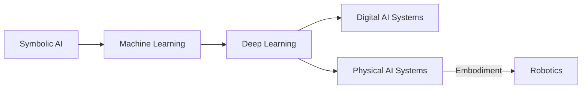

# From Digital to Physical AI

## Learning Objectives
- Understand the historical progression from symbolic AI to modern Physical AI.
- Identify limitations of purely digital AI in real-world scenarios.
- Appreciate the necessity of physical embodiment for general intelligence.

## The Evolution of AI

Artificial intelligence began as a purely digital pursuit, focusing on symbolic reasoning and rule-based systems. Over time, the rise of machine learning and deep learning allowed AI to tackle increasingly complex problems. Yet, these systems remained largely confined to virtual spaces, lacking direct interaction with the physical world.  

The push towards Physical AI arose from this gap: combining advanced algorithms with robots and sensors to enable AI to perceive, act, and adapt in real-world environments.

## Challenges of Digital-Only AI

Digital-only AI struggles to fully understand or operate in dynamic, uncertain environments. Key limitations include:  

- **Lack of sensory feedback:** Virtual systems cannot perceive the physical nuances of objects, terrain, or human interactions.  
- **Limited adaptability:** Without embodiment, AI cannot experiment through trial and error in the real world.  
- **Incomplete understanding of context:** Many real-world scenarios require multimodal sensing (vision, touch, audio) that digital-only systems cannot fully replicate.

## Limitations of Digital-Only AI

Digital-only AI struggles to fully understand or operate in dynamic, uncertain environments. Key limitations include:  

- **Lack of sensory feedback:** Virtual systems cannot perceive the physical nuances of objects, terrain, or human interactions.  
- **Limited adaptability:** Without embodiment, AI cannot experiment through trial and error in the real world.  
- **Incomplete understanding of context:** Many real-world scenarios require multimodal sensing (vision, touch, audio) that digital-only systems cannot fully replicate.


## The Need for Embodiment

Physical embodiment allows AI to directly engage with the world, giving it access to rich sensory data and motor experiences. Robotics provides a platform where AI can:  

- Test and refine perception and decision-making in real scenarios  
- Learn from real-world feedback rather than simulated approximations  
- Interact naturally with humans and other agents  

This integration of AI with robotics is what defines Physical AI: systems that are not only intelligent but **actively situated in the world**.

## Code Examples

```python
# Placeholder for a relevant code example
```

## Diagrams



## Key Takeaways
- AI has evolved significantly, but digital-only systems have inherent limitations.
- Physical embodiment is crucial for AI to truly understand and operate in the real world.
- Physical AI merges advanced AI with robotics for real-world interaction.
