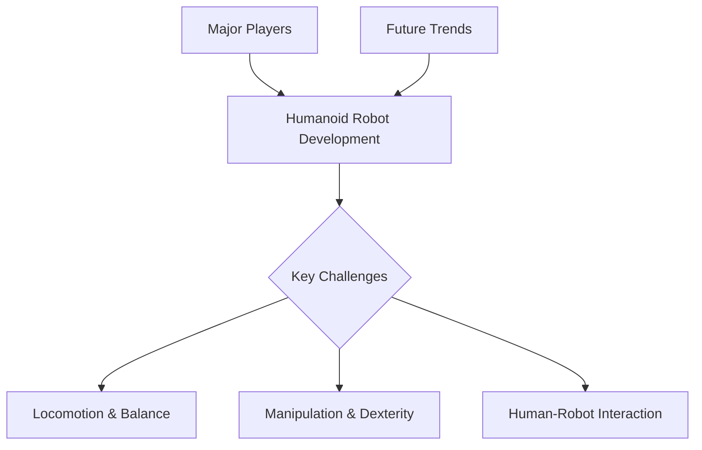

# The Humanoid Landscape

## Learning Objectives
- Identify key characteristics and design principles of humanoid robots.
- Recognize major research institutions and companies in humanoid robotics.
- Understand current capabilities and future challenges for humanoids.

## Introduction to Humanoid Robotics

[Content defining humanoid robots, their unique advantages, and the challenges in their design and control.]

## Current State of Humanoid Development

[Content discussing existing humanoid robots (e.g., Boston Dynamics Atlas, Honda ASIMO, Tesla Bot/Optimus, Unitree H1) and their capabilities.]

## Major Players and Research

[Content highlighting leading companies, research labs, and academic institutions contributing to humanoid robotics.]

## Future Trends and Challenges

[Content on future directions: improved dexterity, robust locomotion, advanced AI integration, ethical considerations, and open research problems.]

## Code Examples

```python
# Placeholder for a relevant code example
```

## Diagrams



## Key Takeaways
- Humanoid robots are complex systems with many challenges.
- Several key players are driving innovation in the field.
- Future development focuses on overcoming current limitations for broader application.
