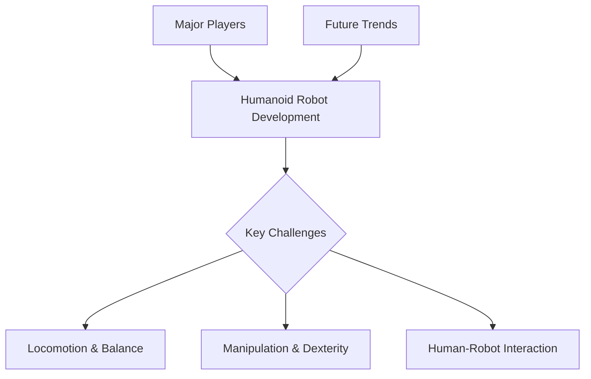

# The Humanoid Landscape

## Learning Objectives
- Identify key characteristics and design principles of humanoid robots.
- Recognize major research institutions and companies in humanoid robotics.
- Understand current capabilities and future challenges for humanoids.

## Introduction to Humanoid Robotics

Humanoid robots are machines designed to resemble and mimic the human body, including the head, torso, arms, and legs. Their primary advantage lies in their ability to operate in environments built for humans, using tools and interfaces designed for human anatomy.

## Current State of Humanoid Development

### Leading Humanoid Robots

**Boston Dynamics Atlas**
- Advanced bipedal locomotion with dynamic balancing
- Impressive parkour and mobility capabilities
- Strong focus on dynamics and control algorithms
- Research-oriented, not yet commercialized

**Honda ASIMO**
- Pioneer in humanoid robotics since the 1980s
- Smooth bipedal walking and stair climbing
- Human-scale form factor (130 cm tall)
- Early influence on the field, production ended in 2018

**Tesla Bot (Optimus)**
- Focus on general-purpose manipulation for manufacturing
- Tall humanoid design (173 cm) for warehouse environments
- Integration with AI and machine learning
- Early prototypes in development

**Unitree H1**
- Compact humanoid with impressive mobility
- Opensource-friendly approach
- Fast locomotion and dynamic stability
- Affordable compared to research robots

### Key Capabilities and Limitations

**Current Strengths:**
- Impressive locomotion on structured terrain
- Dynamic balance recovery
- Basic manipulation tasks
- Improved AI integration for perception

**Remaining Challenges:**
- Dexterity: Human-like hand manipulation is still limited
- Rough terrain: Unpredictable environments remain difficult
- Autonomy: Most robots require tele-operation or pre-programmed tasks
- Cost: Development and production remain expensive
- Energy efficiency: Battery life is limited for extended operation

## Major Players and Research

### Leading Organizations

**Companies:**
- Boston Dynamics (AI-powered robotics)
- Tesla (Optimus, general-purpose robots)
- Honda (ASIMO legacy, new projects)
- Unitree Robotics (affordable humanoids)
- Figure AI (physical reasoning)
- 1X (industrial humanoid development)

**Academic Institutions:**
- MIT (humanoid robotics lab, biomimetics)
- Carnegie Mellon (motion planning, control)
- UC Berkeley (deep learning for robotics)
- Stanford (GRASP robotics)
- ETH Zurich (legged robotics, control)

**Research Focus Areas:**
- Bipedal locomotion and balance
- Dexterous manipulation
- Learning from human demonstrations
- Reinforcement learning for control
- Sensor fusion and perception

## Future Trends and Challenges

### Emerging Directions

1. **Dexterity and Manipulation**
   - Multi-fingered hands with tactile sensing
   - Learning-based grasp planning
   - Real-time force control

2. **Robust Locomotion**
   - Traversing unstructured terrain
   - Climbing and obstacle navigation
   - Adaptation to changing environments

3. **Advanced AI Integration**
   - Large language models for task understanding
   - Vision-language models for scene interpretation
   - End-to-end learning from robot interactions

4. **Human-Robot Collaboration**
   - Safety systems for close human interaction
   - Intuitive teleoperation interfaces
   - Shared autonomy and assistance

### Open Research Problems

- Sample efficiency: Training with fewer real-world interactions
- Transfer learning: Applying knowledge across different robots
- Interpretability: Understanding why robots make decisions
- Safety and reliability: Guaranteed performance in critical tasks
- Energy efficiency: Extended operation without frequent recharging
- Cost reduction: Scaling humanoid production affordably

### Societal Considerations

- Employment impact: Displacement of human workers
- Ethics and safety: Autonomous systems in shared spaces
- Accessibility: Using humanoids to assist elderly and disabled individuals
- Security: Preventing misuse of advanced physical systems
- Environmental impact: Manufacturing and end-of-life concerns

## Code Examples

```python
# Placeholder for a relevant code example
```

## Diagrams



## Key Takeaways
- Humanoid robots are complex systems with many challenges.
- Several key players are driving innovation in the field.
- Future development focuses on overcoming current limitations for broader application.
