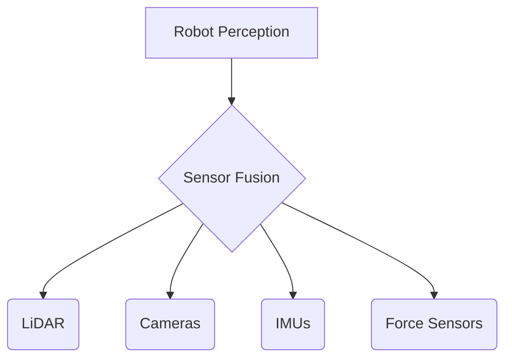

# Sensor Systems for Physical AI

## Learning Objectives
- Understand the working principles of common robotic sensors.
- Identify the role of LiDAR, cameras, IMUs, and force sensors in humanoid perception.
- Evaluate the strengths and limitations of various sensor types.

## Introduction to Robotic Sensors

[Content introducing the importance of sensors for a robot's perception of its environment and internal state.]

## LiDAR (Light Detection and Ranging)

[Content on LiDAR technology, 3D point cloud generation, applications in mapping and navigation, and limitations.]

## Cameras (Monocular, Stereo, Depth)

[Content on different camera types, their use in object detection, recognition, visual odometry, and depth perception.]

## IMUs (Inertial Measurement Units)

[Content on accelerometers, gyroscopes, magnetometers, and their role in orientation, balance, and motion tracking.]

## Force and Torque Sensors

[Content on how these sensors enable robots to interact with objects and environment safely, detect contact, and perform manipulation tasks.]

## Code Examples

```python
# Placeholder for a relevant code example, e.g., reading sensor data
```

## Diagrams



## Key Takeaways
- Diverse sensor systems are critical for comprehensive robot perception.
- Each sensor type provides unique information about the environment or robot state.
- Sensor fusion is often necessary for robust and accurate perception.
