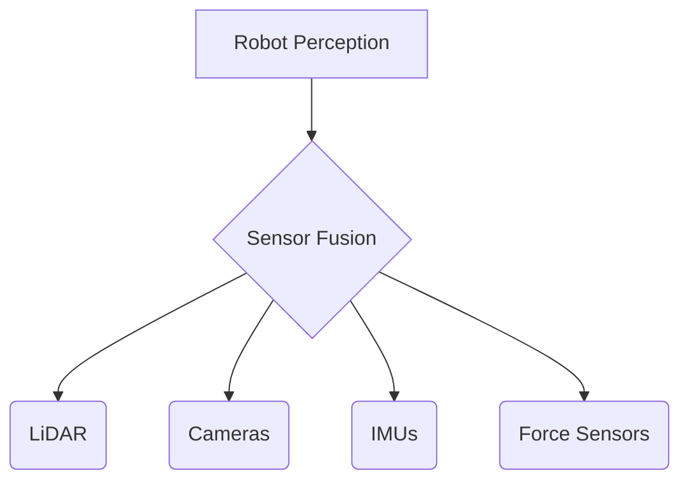

# Sensor Systems for Physical AI

## Learning Objectives
- Understand the working principles of common robotic sensors.
- Identify the role of LiDAR, cameras, IMUs, and force sensors in humanoid perception.
- Evaluate the strengths and limitations of various sensor types.

## Introduction to Robotic Sensors

Sensors are the "senses" of a robot, enabling perception of both the external environment and internal state. For humanoid robots, a diverse array of sensors provides:

- **Environmental Awareness**: What's around the robot?
- **Proprioception**: Where is the robot and what is its orientation?
- **Interoception**: What is the state of the robot's body?
- **Tactile Feedback**: What is the robot touching and with how much force?

Effective robotics requires **sensor fusion** - combining multiple sensors to create a coherent understanding of reality.

## LiDAR (Light Detection and Ranging)

**Working Principle:**
LiDAR uses laser pulses to measure distance to objects by timing how long light takes to return after bouncing off surfaces.

**Advantages:**
- High-resolution 3D point clouds (typically 16-128 channels)
- Works in low-light conditions
- Accurate distance measurement (cm-level precision)
- Relatively fast scanning (10-20 Hz)

**Limitations:**
- Transparent and translucent materials (glass, water) cause errors
- Reflective surfaces can create artifacts
- Limited range (typically 50-150 meters depending on model)
- Higher power consumption than cameras

**Applications:**
- Simultaneous Localization and Mapping (SLAM)
- Obstacle detection and avoidance
- 3D scene reconstruction
- Navigation and path planning

## Cameras (Monocular, Stereo, Depth)

**Monocular Cameras:**
- Single RGB image stream
- Can detect objects and recognize scenes
- Requires additional processing for depth estimation
- Lightweight and power-efficient
- Output: 2D images with color information

**Stereo Cameras:**
- Pair of cameras separated by known distance
- Depth computed from disparity between left/right images
- Dense depth information with color
- Similar principle to human binocular vision
- Output: RGB-D (color + depth) data

**Depth Cameras (RGB-D):**
- Directly measure depth using infrared patterns or structured light
- Examples: Microsoft Kinect, Intel RealSense, Apple LiDAR
- Higher accuracy for close-range depth
- Shorter range than LiDAR

**Applications:**
- Object detection and recognition (using CNN/transformers)
- Visual odometry (estimating movement from image sequences)
- Hand and pose estimation
- Scene segmentation and 3D reconstruction

## IMUs (Inertial Measurement Units)

**Components:**
- **Accelerometer**: Measures linear acceleration in 3 axes
- **Gyroscope**: Measures angular velocity (rotation rate)
- **Magnetometer**: Measures magnetic field (compass heading)

**Key Measurements:**
- Acceleration: a = [ax, ay, az] (including gravity)
- Angular velocity: ω = [ωx, ωy, ωz]
- Magnetic heading: θ

**Applications:**
- **Balance and Stability**: Detecting tilt and fall conditions
- **Motion Tracking**: Estimating orientation and angular motion
- **Activity Recognition**: Identifying what motion the robot is performing
- **Vibration Detection**: Sensing impacts and collisions

## Force and Torque Sensors

**Types:**
- **Load Cells**: Measure force in one direction
- **6-DOF Force/Torque Sensors**: Measure Fx, Fy, Fz, τx, τy, τz
- **Pressure Sensors**: Distributed pressure sensing on skin-like surfaces
- **Tactile Arrays**: Dense grids of touch sensors

**Applications:**
- **Manipulation Safety**: Limiting force during grasping and pushing
- **Impedance Control**: Adjusting stiffness and damping
- **Grasp Stability**: Detecting slip and adjusting grip
- **Contact Detection**: Knowing when and where the robot touches objects
- **Interaction Control**: Fine force control during human-robot collaboration

## Code Examples

```python
import numpy as np
from typing import Dict

class SensorFusion:
    """Example of multi-sensor fusion for robot state estimation"""
    
    def __init__(self):
        self.lidar_points = None
        self.camera_image = None
        self.imu_data = None
        self.force_data = None
    
    def fuse_perception(self) -> Dict:
        """Combine all sensor modalities"""
        environment = self.process_lidar()
        objects = self.detect_objects_camera()
        orientation = self.estimate_imu_orientation()
        contact_state = self.analyze_forces()
        
        return {
            'environment': environment,
            'objects': objects,
            'orientation': orientation,
            'contact': contact_state
        }
    
    def process_lidar(self) -> np.ndarray:
        """Process LiDAR point cloud"""
        return self.lidar_points
    
    def detect_objects_camera(self) -> list:
        """Use computer vision for object detection"""
        return []
    
    def estimate_imu_orientation(self) -> np.ndarray:
        """Estimate robot orientation from IMU"""
        return np.eye(3)
    
    def analyze_forces(self) -> Dict:
        """Analyze force/torque sensor data"""
        return {'contact': False, 'force': np.zeros(3)}
```

## Diagrams



## Key Takeaways
- Diverse sensor systems are critical for comprehensive robot perception.
- Each sensor type provides unique information about the environment or robot state.
- Sensor fusion is often necessary for robust and accurate perception.
