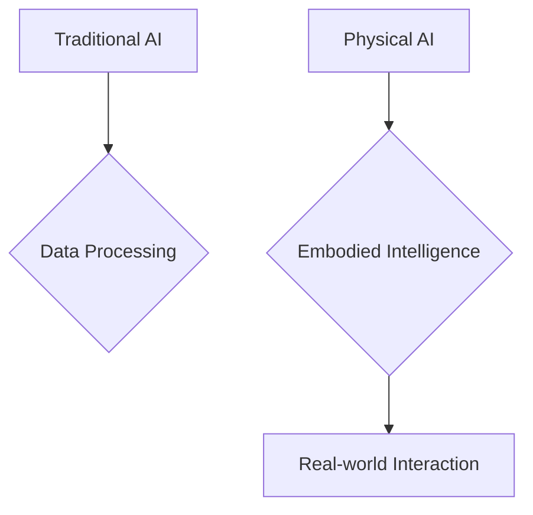

# What is Physical AI?

## Learning Objectives
- Define Physical AI and differentiate it from traditional AI.
- Understand the concept of embodied intelligence.
- Recognize the interdisciplinary nature of Physical AI.

## Introduction to Physical AI

Physical AI represents a paradigm shift in artificial intelligence where computational systems are embodied in physical form and interact directly with the real world. Unlike traditional AI systems that operate purely in digital environments, Physical AI integrates perception, reasoning, and action to enable machines to understand and manipulate physical environments.

**Key Characteristics:**
- **Embodiment**: AI systems have physical bodies that interact with the environment
- **Perception**: Direct sensing of environmental state through multiple sensors
- **Action**: Ability to modify the environment through actuators and motors
- **Real-world Interaction**: Constrained by physics, not just algorithms
- **Continuous Learning**: Adaptation through physical interaction and feedback

## Embodied Intelligence

Embodied intelligence refers to the idea that cognition and intelligence are deeply rooted in the body's interactions with the world. Rather than intelligence being purely abstract computation, embodied intelligence emerges from:

1. **Sensorimotor Experience**: Learning through physical experience and movement
2. **Environmental Coupling**: Direct interaction creates feedback loops that shape learning
3. **Constraint-based Learning**: Physical laws and constraints guide development
4. **Grounded Meaning**: Concepts are grounded in physical experience, not just symbols

For humanoid robots, this means that understanding how to walk, grasp, or balance is not just programmed but learned through interaction with gravity, friction, and mechanical constraints.

## The Interdisciplinary Field

Physical AI combines insights and techniques from multiple disciplines:

- **Robotics**: Hardware design, mechanical systems, actuators
- **Control Theory**: Feedback loops, stability, dynamic systems
- **Machine Learning**: Neural networks, reinforcement learning, computer vision
- **Computer Science**: Algorithms, planning, real-time systems
- **Physics**: Dynamics, kinematics, biomechanics
- **Neuroscience**: Motor control, sensorimotor integration
- **Engineering**: Systems integration, reliability

## Code Examples

```python
import numpy as np
from dataclasses import dataclass

@dataclass
class PhysicalState:
    """Represents the state of a physical system at time t"""
    position: np.ndarray      # 3D position [x, y, z]
    velocity: np.ndarray      # Linear velocity
    orientation: np.ndarray   # Quaternion [w, x, y, z]
    angular_velocity: np.ndarray  # Rotation rate
    timestamp: float

class PhysicalAIAgent:
    """Base class for Physical AI agents"""
    
    def __init__(self, name: str):
        self.name = name
        self.state: PhysicalState = None
    
    def perceive(self) -> dict:
        """Gather sensor data from environment"""
        perception = {}
        return perception
    
    def plan(self, perception: dict) -> dict:
        """Process perception and generate action plan"""
        pass
    
    def act(self, actions: dict) -> None:
        """Execute actions through actuators"""
        pass
    
    def control_loop(self):
        """Main sense-think-act loop"""
        perception = self.perceive()
        actions = self.plan(perception)
        self.act(actions)
```

## Diagrams



## Key Takeaways
- Physical AI integrates AI with physical systems.
- Embodied intelligence emphasizes interaction with the environment.
- It's a multidisciplinary field.
