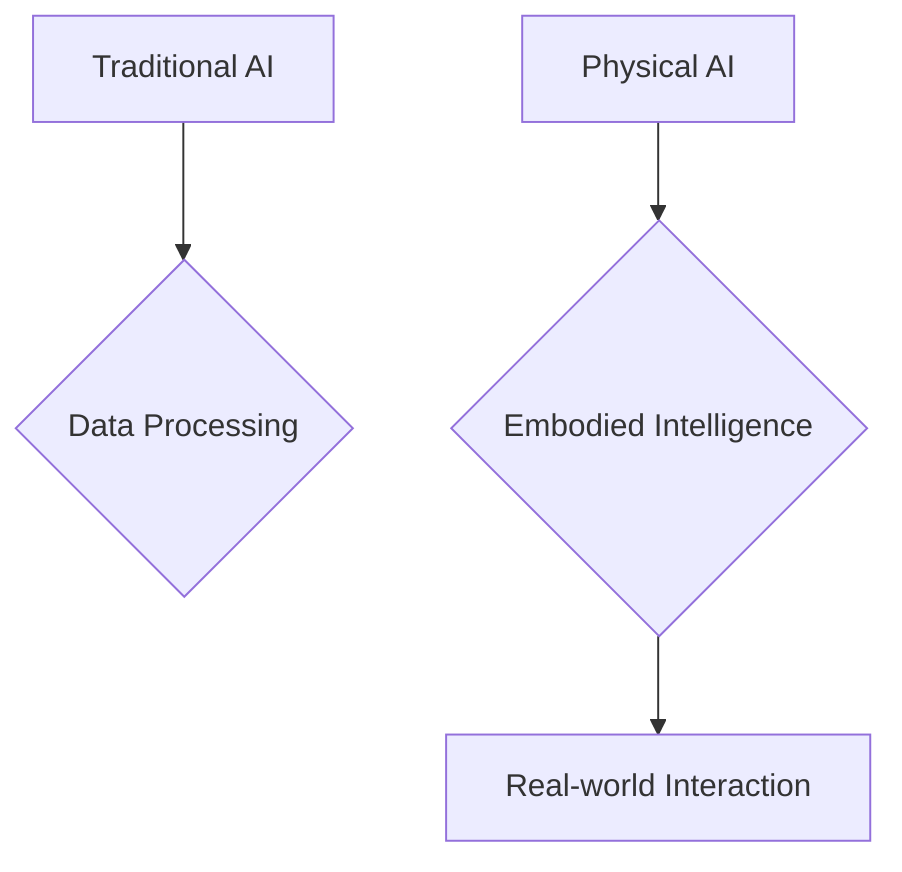

# What is Physical AI?

## Learning Objectives
- Define Physical AI and differentiate it from traditional AI.
- Understand the concept of embodied intelligence.
- Recognize the interdisciplinary nature of Physical AI.

## Introduction to Physical AI

[Content about Physical AI definition, its history, and key concepts.]

## Embodied Intelligence

[Content about how physical presence and interaction shape intelligence.]

## The Interdisciplinary Field

[Content about the convergence of robotics, AI, machine learning, and control systems.]

## Code Examples

```python
# Placeholder for a relevant code example
```

## Diagrams



## Key Takeaways
- Physical AI integrates AI with physical systems.
- Embodied intelligence emphasizes interaction with the environment.
- It's a multidisciplinary field.
