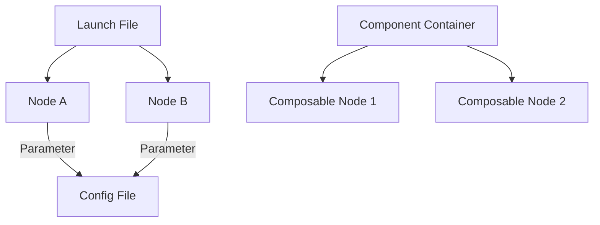

# ROS 2 Launch Files and Parameters

## Learning Objectives
- Create and use ROS 2 launch files to start multiple nodes.
- Understand how to define and manage parameters for ROS 2 nodes.
- Utilize component containers for efficient process management.

## Introduction to ROS 2 Launch System

The ROS 2 launch system is a powerful tool for starting, configuring, and managing a collection of ROS 2 nodes and other processes simultaneously. Instead of manually running each node in separate terminal windows, launch files allow you to define a complex system's entire startup procedure in a single, organized script. This is crucial for orchestrating robotic applications, which often involve many interconnected nodes for tasks like sensor data processing, navigation, and motor control. Launch files can also manage parameters, remap topic names, and handle conditional execution, providing a flexible way to configure your robot's software stack.

## Writing Launch Files (Python)

ROS 2 launch files are commonly written in Python, offering flexibility and programmatic control over the launch process. Here's a step-by-step guide to creating one:

1.  **Create a `launch` directory**: Inside your ROS 2 package, create a `launch` directory to store your launch files (e.g., `my_python_package/launch`).

2.  **Create a Python launch file**: Create a Python file (e.g., `my_robot.launch.py`) within this `launch` directory.

3.  **Import necessary modules**: You'll typically need `LaunchDescription` from `launch` and `Node` from `launch_ros.actions`.

4.  **Define `generate_launch_description()` function**: This function is the entry point for your launch file. It must return a `LaunchDescription` object.

5.  **Add `Node` actions**: Use the `Node` action to specify which ROS 2 nodes to run. Key arguments include:
    *   `package`: The name of the ROS 2 package containing the executable.
    *   `executable`: The name of the executable (as defined in `setup.py` for Python packages).
    *   `name`: An optional, unique name for the node instance.
    *   `namespace`: An optional namespace for the node.
    *   `parameters`: A list of dictionaries or paths to YAML files for setting node parameters.
    *   `arguments`: Command-line arguments to pass to the executable.
    *   `remappings`: A list of `('old_name', 'new_name')` tuples to remap topics, services, or actions.

6.  **Include other actions**: Besides `Node`, you can use other actions like `ExecuteProcess` to run arbitrary shell commands, `IncludeLaunchDescription` to nest launch files, and `OpaqueFunction` for more complex Python logic.

Here's an example that launches two nodes, `my_node` from `my_python_package` and `another_node` from `another_package`, and sets a parameter for `my_node`:

### Example Launch File

```python
from launch import LaunchDescription
from launch_ros.actions import Node

def generate_launch_description():
    return LaunchDescription([
        Node(
            package='my_python_package',
            executable='my_node',
            name='my_node_instance',
            parameters=[{'my_parameter': 'hello'}]
        ),
        Node(
            package='another_package',
            executable='another_node',
            name='another_node_instance'
        )
    ])
```

## ROS 2 Parameters

ROS 2 parameters provide a mechanism for nodes to expose configurable values. These parameters can be set when a node is launched (via launch files), changed dynamically at runtime, or inspected using command-line tools. They allow you to modify a node's behavior without needing to recompile its code, making your robotic system more adaptable.

Parameters can be declared within a node using `node.declare_parameter()`. Their values can be read using `node.get_parameter()`. In launch files, you can set parameters directly using a dictionary, as seen in the example above, or by loading them from a YAML file.

### Accessing Parameters in a Node

```python
import rclpy
from rclpy.node import Node

class ParameterReaderNode(Node):
    def __init__(self):
        super().__init__('parameter_reader_node')
        self.declare_parameter('my_parameter', 'default_value')
        my_parameter = self.get_parameter('my_parameter').get_parameter_value().string_value
        self.get_logger().info(f'My parameter is: {my_parameter}')

def main(args=None):
    rclpy.init(args=args)
    node = ParameterReaderNode()
    rclpy.spin(node)
    node.destroy_node()
    rclpy.shutdown()

if __name__ == '__main__':
    main()
```

## Component Containers

Component containers allow you to run multiple ROS 2 nodes within a *single process*. This approach, known as *intra-process communication*, significantly reduces overhead compared to running each node as a separate executable. By eliminating the need for serialization/deserialization and inter-process communication (IPC), component containers can improve performance and reduce latency.

The `composition` package in ROS 2 provides tools for creating and managing component containers. Nodes that are designed to be run within a container are called `ComposableNode`s. You can include `ComposableNode`s in your launch files, specifying which container they should run in. This is particularly useful for resource-constrained environments or applications requiring high data throughput between nodes.

## Code Examples

```python
from launch import LaunchDescription
from launch.actions import DeclareLaunchArgument
from launch.substitutions import LaunchConfiguration
from launch_ros.actions import Node

def generate_launch_description():
    # Declare a launch argument for the 'robot_name'
    robot_name_arg = DeclareLaunchArgument(
        'robot_name',
        default_value='my_robot',
        description='Name of the robot')

    # Node that uses the declared parameter
    my_node = Node(
        package='my_python_package',
        executable='my_node',
        name='controller_node',
        parameters=[
            {'robot_id': LaunchConfiguration('robot_name')},
            {'speed': 0.5}
        ],
        remappings=[
            ('cmd_vel', '/' + LaunchConfiguration('robot_name') + '/cmd_vel')
        ]
    )

    # Another node, demonstrating a different package
    another_node = Node(
        package='another_package',
        executable='sensor_publisher',
        name='sensor_node',
        namespace=LaunchConfiguration('robot_name')
    )

    return LaunchDescription([
        robot_name_arg,
        my_node,
        another_node
    ])
```

## Diagrams



## Key Takeaways
- Launch files automate the startup of complex ROS 2 systems.
- Parameters provide configurable settings for nodes.
- Component containers optimize resource usage by grouping nodes.
