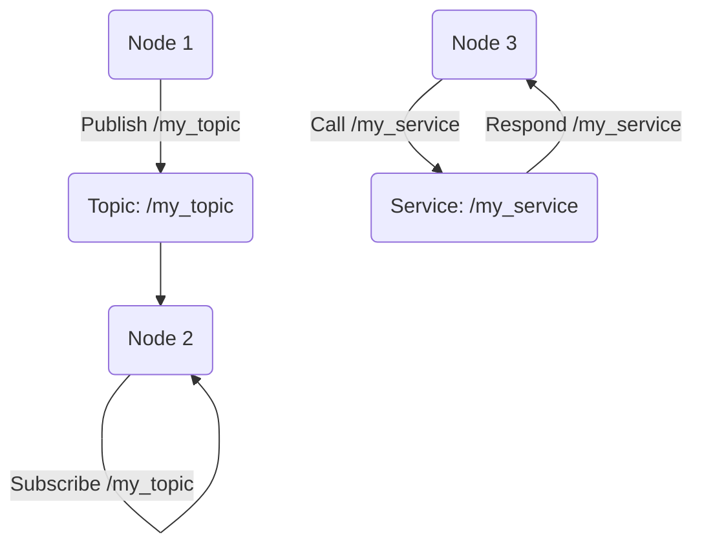

# ROS 2 Nodes, Topics, and Services

## Learning Objectives
- Define ROS 2 nodes and their role in a robotic system.
- Understand the publish/subscribe communication model using topics.
- Grasp the request/reply communication model using services.
- Implement basic ROS 2 nodes, publishers, subscribers, and service clients/servers using `rclpy`.

## ROS 2 Nodes

In ROS 2, a **node** is an executable process that performs computation. A complete robotic system is typically composed of many nodes, each responsible for a specific function. For example, a robot might have separate nodes for:

*   Reading sensor data (e.g., a lidar driver node)
*   Processing images (e.g., an object detection node)
*   Calculating robot kinematics (e.g., a motion control node)
*   Planning paths (e.g., a navigation node)

Nodes are designed to be modular and independent, allowing developers to build complex systems by combining smaller, manageable components. They communicate with each other using various ROS 2 communication mechanisms, such as topics, services, and actions.

## Topics: Publish/Subscribe Communication

**Topics** are the primary mechanism for asynchronous, one-to-many communication in ROS 2. They represent named data streams where nodes can publish messages and other nodes can subscribe to receive those messages. This model is ideal for continuous data flows, such as sensor readings, robot joint states, or diagnostic information.

*   **Publishers**: Nodes that send messages to a specific topic.
*   **Subscribers**: Nodes that listen for and receive messages from a specific topic.

Key characteristics of topics:

*   **Decoupled**: Publishers and subscribers don't need to know about each other's existence. The DDS middleware handles the discovery and data transfer.
*   **Message Types**: Every topic has a defined message type (e.g., `std_msgs/String`, `sensor_msgs/Image`). This ensures that data is structured and interpreted consistently.
*   **Quality of Service (QoS)**: ROS 2 provides robust QoS settings that allow developers to fine-tune communication characteristics, such as reliability (guaranteed vs. best effort), durability (latching), and history (keep last N messages). These settings are crucial for meeting the requirements of different robotic applications.

## Services: Request/Reply Communication

**Services** in ROS 2 provide a synchronous request/reply communication model. Unlike topics, which are designed for continuous data streams, services are used for one-off operations where a client node sends a request to a service server node and waits for a response. This is analogous to a function call in traditional programming.

*   **Service Servers**: Nodes that offer a service and process requests from clients.
*   **Service Clients**: Nodes that send requests to a service server and receive responses.

Key characteristics of services:

*   **Synchronous**: The client typically blocks until it receives a response from the server.
*   **Request/Response Types**: Each service has a defined request message type and a response message type (e.g., `example_interfaces/AddTwoInts` with `AddTwoInts.Request` and `AddTwoInts.Response`).
*   **Deterministic Operations**: Services are suitable for operations that have a clear start and end, and where a result is immediately expected (e.g., triggering a robot arm to pick up an object, querying a map server for a specific landmark).

## Code Examples (rclpy)

### Minimal Publisher Node

```python
import rclpy
from rclpy.node import Node
from std_msgs.msg import String

class MinimalPublisher(Node):
    def __init__(self):
        super().__init__('minimal_publisher')
        self.publisher_ = self.create_publisher(String, 'topic', 10)
        timer_period = 0.5  # seconds
        self.timer = self.create_timer(timer_period, self.timer_callback)
        self.i = 0

    def timer_callback(self):
        msg = String()
        msg.data = 'Hello World: %d' % self.i
        self.publisher_.publish(msg)
        self.get_logger().info('Publishing: "%s"' % msg.data)
        self.i += 1

def main(args=None):
    rclpy.init(args=args)
    minimal_publisher = MinimalPublisher()
    rclpy.spin(minimal_publisher)
    minimal_publisher.destroy_node()
    rclpy.shutdown()

if __name__ == '__main__':
    main()
```

### Minimal Subscriber Node

```python
import rclpy
from rclpy.node import Node
from std_msgs.msg import String

class MinimalSubscriber(Node):
    def __init__(self):
        super().__init__('minimal_subscriber')
        self.subscription = self.create_subscription(
            String,
            'topic',
            self.listener_callback,
            10)
        self.subscription  # prevent unused variable warning

    def listener_callback(self, msg):
        self.get_logger().info('I heard: "%s"' % msg.data)

def main(args=None):
    rclpy.init(args=args)
    minimal_subscriber = MinimalSubscriber()
    rclpy.spin(minimal_subscriber)
    minimal_subscriber.destroy_node()
    rclpy.shutdown()

if __name__ == '__main__':
    main()
```

### Minimal Service Server Node

```python
import rclpy
from rclpy.node import Node
from example_interfaces.srv import AddTwoInts  # Example service type

class MinimalService(Node):
    def __init__(self):
        super().__init__('minimal_service')
        self.srv = self.create_service(AddTwoInts, 'add_two_ints', self.add_two_ints_callback)

    def add_two_ints_callback(self, request, response):
        response.sum = request.a + request.b
        self.get_logger().info('Incoming request: a: %d b: %d' % (request.a, request.b))
        return response

def main(args=None):
    rclpy.init(args=args)
    minimal_service = MinimalService()
    rclpy.spin(minimal_service)
    minimal_service.destroy_node()
    rclpy.shutdown()

if __name__ == '__main__':
    main()
```

### Minimal Service Client Node

```python
import rclpy
from rclpy.node import Node
from example_interfaces.srv import AddTwoInts

class MinimalClientAsync(Node):
    def __init__(self):
        super().__init__('minimal_client_async')
        self.cli = self.create_client(AddTwoInts, 'add_two_ints')
        while not self.cli.wait_for_service(timeout_sec=1.0):
            self.get_logger().info('service not available, waiting again...')
        self.req = AddTwoInts.Request()

    def send_request(self, a, b):
        self.req.a = a
        self.req.b = b
        self.future = self.cli.call_async(self.req)
        rclpy.spin_until_future_complete(self, self.future)
        return self.future.result()

def main(args=None):
    rclpy.init(args=args)
    minimal_client = MinimalClientAsync()
    response = minimal_client.send_request(2, 3)
    minimal_client.get_logger().info(
        'Result of add_two_ints: for %d + %d = %d' % (minimal_client.req.a, minimal_client.req.b, response.sum))
    minimal_client.destroy_node()
    rclpy.shutdown()

if __name__ == '__main__':
    main()
```

## Diagrams



## Key Takeaways
- ROS 2 systems are built from interconnected nodes.
- Topics enable asynchronous one-to-many data streaming.
- Services enable synchronous request-reply interactions.
- `rclpy` is the Python client library for ROS 2.
