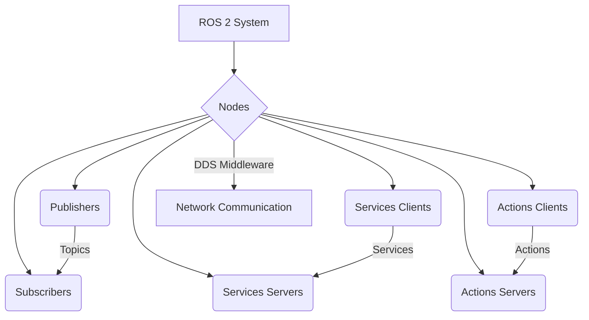

# ROS 2 Architecture

## Learning Objectives
- Understand the fundamental components of ROS 2.
- Explain the role of Data Distribution Service (DDS) in ROS 2.
- Differentiate between ROS 1 and ROS 2 architectures.

## Introduction to ROS 2

ROS 2 is the successor to the original Robot Operating System (ROS), designed to address the challenges of modern robotics, including real-time performance, multi-robot systems, and embedded platforms. It provides a flexible framework for writing robot software, handling communication, and managing hardware.

Key improvements over ROS 1 include:
-   **Distributed Architecture**: Built on Data Distribution Service (DDS), enabling peer-to-peer communication without a central master node, enhancing robustness and scalability.
-   **Real-time Capabilities**: Improved support for real-time control, crucial for applications requiring precise timing.
-   **Security**: Enhanced communication security features through DDS security plugins, including authentication, authorization, and encryption.
-   **Multi-robot Support**: Designed from the ground up to support multiple robots interacting in the same environment.
-   **Quality of Service (QoS)**: Fine-grained control over communication reliability, latency, and durability.

## Core Concepts

ROS 2 systems are composed of various interconnected components that work together to enable complex robot behaviors:

-   **Nodes**: The fundamental building blocks of a ROS 2 system. Each node is an executable process that performs a specific task (e.g., a camera driver, a motor controller, a navigation algorithm).
-   **Topics**: A publish/subscribe communication mechanism. Nodes publish messages to topics, and other nodes subscribe to those topics to receive the messages. This is ideal for continuous, asynchronous data streams (e.g., sensor readings, joint states).
-   **Services**: A request/reply communication mechanism. Services allow nodes to send a request to another node and wait for a synchronous response. This is suitable for one-off operations that require a direct result (e.g., get robot's current pose, set a specific parameter).
-   **Actions**: A long-running, goal-oriented communication mechanism. Actions extend services by providing feedback during execution, allowing for preemption, and reporting a final result. They are typically used for tasks that take time to complete (e.g., move robot to a goal, perform a complex manipulation).
-   **Parameters**: Key-value pairs that allow nodes to be configured at runtime. Parameters can be changed dynamically without recompiling the node, making systems more flexible.

## Data Distribution Service (DDS)

At the heart of ROS 2's distributed architecture is the **Data Distribution Service (DDS)**. DDS is an open international standard for real-time, peer-to-peer data sharing. It acts as the communication middleware, enabling nodes to discover each other and exchange data without a central broker.

Key benefits of using DDS in ROS 2:

*   **Decentralized**: Unlike ROS 1's master-slave architecture, DDS allows nodes to communicate directly, eliminating single points of failure and improving scalability.
*   **Discovery**: DDS automatically discovers participants (nodes) and data streams (topics, services, actions) on the network.
*   **Quality of Service (QoS)**: DDS provides a rich set of QoS policies that can be configured for each data stream. These policies govern aspects like reliability, history, deadline, liveliness, and durability, allowing developers to tailor communication to specific application needs (e.g., ensuring critical sensor data is never lost).
*   **Real-time Capabilities**: DDS is designed for real-time systems, providing predictable performance and low-latency communication.
*   **Interoperability**: Being an international standard, DDS promotes interoperability with other DDS-compliant systems.

This shift from ROS 1's custom TCP/UDP transport to a standardized DDS middleware is a fundamental architectural improvement, enhancing ROS 2's robustness, flexibility, and suitability for production-grade robotics.

## ROS 1 vs. ROS 2

ROS 1 and ROS 2 share a common goal: to provide a flexible framework for robot software development. However, ROS 2 was re-architected to address several limitations of ROS 1, particularly concerning modern robotics requirements. Here's a comparison of key architectural differences:

| Feature             | ROS 1                                   | ROS 2                                                      |
| :------------------ | :-------------------------------------- | :--------------------------------------------------------- |
| **Communication**   | Custom TCP/UDP with a central ROS Master | DDS (Data Distribution Service) for decentralized, peer-to-peer communication |
| **Architecture**    | Centralized (ROS Master)                | Distributed (no central master)                            |
| **Real-time**       | Limited                                 | Improved support for real-time control                     |
| **Security**        | None built-in                           | DDS Security (authentication, authorization, encryption)   |
| **Multi-robot**     | Challenging to implement                | Designed for multi-robot systems                           |
| **QoS**             | Basic                                   | Extensive QoS policies                                     |
| **Platforms**       | Primarily Linux                         | Cross-platform (Linux, Windows, macOS, RTOS)               |
| **Lifecycle Mgmt.** | Manual                                  | Managed node lifecycles                                    |

The move to DDS in ROS 2 is the most significant change, enabling a more robust, scalable, and secure framework suitable for a wider range of robotic applications, from industrial automation to autonomous vehicles.

## Code Examples

```python
import rclpy
from rclpy.node import Node

class MinimalNode(Node):
    def __init__(self):
        super().__init__('minimal_node')
        self.get_logger().info('Minimal ROS 2 node has started!')

def main(args=None):
    rclpy.init(args=args)
    node = MinimalNode()
    rclpy.spin(node)
    node.destroy_node()
    rclpy.shutdown()

if __name__ == '__main__':
    main()
```

## Diagrams



## Key Takeaways
- ROS 2 is a distributed robotics framework using DDS.
- Key components include nodes, topics, services, and actions.
- It offers significant improvements over ROS 1 in critical areas.
