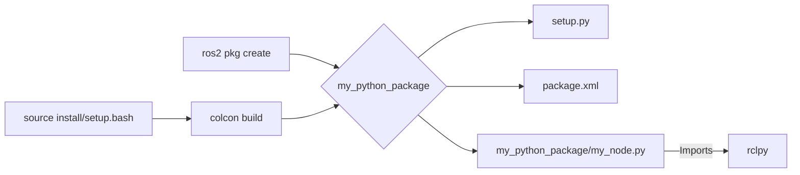

# Building ROS 2 Packages with rclpy

## Learning Objectives
- Create a new ROS 2 Python package using `colcon`.
- Understand the structure of a ROS 2 Python package.
- Write Python nodes using the `rclpy` client library.
- Compile and install ROS 2 Python packages.

## Introduction to ROS 2 Packages

ROS 2 packages are the fundamental units for organizing code in a ROS 2 workspace. They encapsulate executable nodes, libraries, configuration files, and other resources. This modular structure promotes code reusability, simplifies development, and facilitates collaboration across complex robotics projects. Each package is self-contained, with its own build rules and dependencies, making it easy to manage and distribute components of a larger robotic system.

## Creating a New Python Package

To create a new ROS 2 Python package, you'll use the `ros2 pkg create` command. This command sets up the basic directory structure and essential configuration files.

First, navigate to your ROS 2 workspace's `src` directory:

```bash
cd ~/ros2_ws/src
```

Now, create your new Python package. We'll name it `my_python_package` and specify `ament_python` as the build type:

```bash
ros2 pkg create --build-type ament_python my_python_package
```

This command generates a directory named `my_python_package` with the following basic structure:

```
my_python_package/
├── package.xml
├── setup.py
├── my_python_package/
│   └── __init__.py
└── resource/
    └── my_python_package
```

*   **`package.xml`**: This file contains metadata about your package, such as its name, version, description, maintainer, license, and dependencies.
*   **`setup.py`**: This Python script is used by `ament_python` to define how your package is built and installed. It specifies the executable scripts, data files, and other installation rules.
*   **`my_python_package/`**: This is the Python module directory. Your Python source files (nodes, libraries) will reside here. The `__init__.py` file makes it a Python package.
*   **`resource/`**: Contains a marker file for ROS 2 to locate your package resources.

### `package.xml`

```xml
<!-- Example package.xml -->
<?xml version="1.0"?>
<?xml-model href="http://download.ros.org/schema/package_format3.xsd" schematypens="http://www.w3.org/2001/XMLSchema"?>
<package format="3">
  <name>my_python_package</name>
  <version>0.0.0</version>
  <description>TODO: Package description</description>
  <maintainer email="user@example.com">Your Name</maintainer>
  <license>TODO: License declaration</license>

  <depend>rclpy</depend>
  <depend>std_msgs</depend>

  <test_depend>python3-pytest</test_depend>

  <export>
    <build_type>ament_python</build_type>
  </export>
</package>
```

### `setup.py`

```python
# Example setup.py
from setuptools import find_packages, setup

package_name = 'my_python_package'

setup(
    name=package_name,
    version='0.0.0',
    packages=find_packages(exclude=['test']),
    data_files=[
        ('share/' + package_name, ['package.xml']),
        ('share/ament_index/resource_index/packages',
            ['resource/' + package_name]),
    ],
    install_requires=['setuptools'],
    zip_safe=True,
    maintainer='Your Name',
    maintainer_email='user@example.com',
    description='TODO: Package description',
    license='TODO: License declaration',
    tests_require=['pytest'],
    entry_points={
        'console_scripts': [
            'my_node = my_python_package.my_node:main',
        ],
    },
)
```

## Writing Python Nodes with rclpy

Python nodes in ROS 2 are typically written using the `rclpy` client library. A node is a self-contained executable that performs a specific task. To integrate a Python node into your package, you'll create a Python file (e.g., `my_node.py`) inside your `my_python_package` directory.

Here's how to structure a basic ROS 2 Python node:

1.  **Import `rclpy` and `Node`**: These are essential for creating a ROS 2 node.
2.  **Define a class that inherits from `rclpy.node.Node`**: This class will contain your node's logic.
3.  **Implement the `__init__` method**: Call `super().__init__('your_node_name')` to initialize the node.
4.  **Create a `main` function**: This function initializes `rclpy`, creates an instance of your node, spins it to process callbacks, and then shuts it down gracefully.
5.  **Define an entry point in `setup.py`**: This tells ROS 2 how to run your node as an executable.

Let's create a simple Python node. Inside your `my_python_package` directory, create a file named `my_node.py` with the following content:

```python
import rclpy
from rclpy.node import Node

class MySimpleNode(Node):
    def __init__(self):
        super().__init__('my_simple_node')
        self.get_logger().info('My simple node has started!')

def main(args=None):
    rclpy.init(args=args)
    node = MySimpleNode()
    rclpy.spin(node)
    node.destroy_node()
    rclpy.shutdown()

if __name__ == '__main__':
    main()
```

Next, you need to add an entry point to your `setup.py` file so that `colcon` knows how to build and install your executable. Locate the `entry_points` dictionary in `setup.py` (around line 70) and ensure it looks like this:

```python
entry_points={
    'console_scripts': [
        'my_node = my_python_package.my_node:main',
    ],
},
```

This line maps the executable name `my_node` to the `main` function within `my_node.py` in your `my_python_package` Python module.

## Compiling and Installing Packages

After creating and modifying your package, you need to build your ROS 2 workspace using `colcon` and then source the setup files to make your new package available to the ROS 2 environment.

First, navigate back to the root of your ROS 2 workspace:

```bash
cd ~/ros2_ws
```

Now, build your workspace. The `--packages-select` flag can be used to build only your specific package, which is useful for faster iteration:

```bash
colcon build --packages-select my_python_package
```

If the build is successful, you will see output indicating that `my_python_package` was built. After building, you must *source* the `setup.bash` (or `setup.zsh`/`setup.ps1` for other shells) file in your `install` directory to add your package's executables and libraries to your environment:

```bash
source install/setup.bash
```

Now you should be able to run your node:

```bash
ros2 run my_python_package my_node
```

You should see the output from your node:

```
[INFO] [my_simple_node]: My simple node has started!
```

## Code Examples

```python
# Example of a simple ROS 2 Python node within a package
import rclpy
from rclpy.node import Node

class MySimpleNode(Node):
    def __init__(self):
        super().__init__('my_simple_node')
        self.get_logger().info('My simple node has started!')

def main(args=None):
    rclpy.init(args=args)
    node = MySimpleNode()
    rclpy.spin(node)
    node.destroy_node()
    rclpy.shutdown()

if __name__ == '__main__':
    main()
```

## Diagrams



## Key Takeaways
- ROS 2 packages organize robotic software.
- `rclpy` is used for Python nodes.
- `colcon` is the build system for ROS 2 packages.
- `setup.py` and `package.xml` define package metadata and entry points.
