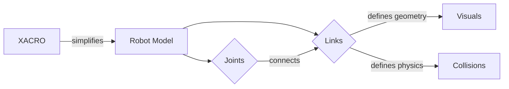

# URDF for Humanoid Robots

## Learning Objectives
- Understand the basics of URDF for robot modeling.
- Represent humanoid robot kinematics and visual properties using URDF.
- Learn how to incorporate meshes and joint limits.
- Visualize URDF models in ROS 2.

## Introduction to URDF

The Unified Robot Description Format (URDF) is an XML file format used in ROS 2 to describe all aspects of a robot. This includes its kinematic and dynamic properties, visual appearance, and collision geometries. URDF files are essential for:

*   **Simulation**: Robot simulators (like Gazebo) use URDF to accurately represent the robot's physical properties and interactions with the environment.
*   **Visualization**: Tools like `Rviz` can parse URDF files to display a 3D model of the robot, showing its links and joints in real-time.
*   **Control**: URDF provides a standardized way to define the robot's structure, which is crucial for inverse kinematics, motion planning, and control algorithms.

For humanoid robots, URDF allows us to precisely model the complex articulated structure, including the torso, head, arms, and legs, and their various degrees of freedom.

## URDF Structure: Links and Joints

The fundamental building blocks of any URDF model are **links** and **joints**.

*   **`<link>`**: Represents a rigid body part of the robot. Each link has properties such as its inertial characteristics (mass, inertia matrix), visual representation (how it looks), and collision properties (how it interacts physically).

*   **`<joint>`**: Defines the kinematic and dynamic connection between two links: a `parent` link and a `child` link. Joints specify the type of motion allowed between these links and can include limits on position, velocity, and effort. Common joint types include:
    *   **`revolute`**: A rotating joint with a single axis of rotation (e.g., an elbow or knee joint).
    *   **`prismatic`**: A sliding joint with a single translational axis (e.g., a linear actuator).
    *   **`fixed`**: A rigid connection that does not allow any relative motion between the links. Useful for connecting static parts or the base of the robot to the world.
### Example Link and Joint

```xml
<link name="base_link">
  <visual>
    <geometry>
      <box size="0.6 0.4 0.2" />
    </geometry>
  </visual>
</link>

<joint name="joint1" type="revolute">
  <parent link="base_link"/>
  <child link="link1"/>
  <origin xyz="0 0 0.1" rpy="0 0 0"/>
  <axis xyz="0 0 1"/>
  <limit lower="-1.57" upper="1.57" effort="10" velocity="1"/>
</joint>
```

## Humanoid Robot Modeling

Modeling humanoid robots in URDF involves creating a complex kinematic chain that mimics the human body. This typically includes:

*   **Torso and Pelvis**: The central links that form the base of the upper and lower body.
*   **Legs**: Multiple links (thigh, shin, foot) connected by revolute joints to simulate hip, knee, and ankle movements.
*   **Arms**: Similar to legs, with links for upper arm, forearm, and hand, connected by shoulder, elbow, and wrist joints.
*   **Head and Neck**: Links for the head and neck, connected by appropriate joints to allow for pan and tilt movements.

Challenges in humanoid modeling include managing the high number of degrees of freedom (DoF), ensuring accurate mass and inertia properties for dynamic simulation, and correctly defining joint limits to prevent unrealistic or self-colliding poses. The precise arrangement of joints and links is critical for achieving realistic motion and stable balance.

## Visuals and Collisions

URDF allows you to define both the visual appearance and physical collision properties of each link. These are defined within `<visual>` and `<collision>` tags, respectively, inside a `<link>` element.

*   **`<visual>`**: Describes how the link should be rendered. You can specify simple geometries like boxes, cylinders, or spheres, or more complex shapes using mesh files (e.g., `.stl` for static models, `.dae` for colored or textured models). It also includes properties for color and material.

    ```xml
    <visual>
      <geometry>
        <mesh filename="package://my_robot_description/meshes/torso.stl" scale="0.001 0.001 0.001"/>
      </geometry>
      <material name="blue">
        <color rgba="0 0 0.8 1"/>
      </material>
    </visual>
    ```

*   **`<collision>`**: Defines the shape used for collision detection in simulations. This is often a simplified representation of the visual geometry to reduce computational load. It's crucial for preventing robot parts from passing through each other or interacting unrealistically with the environment.

    ```xml
    <collision>
      <geometry>
        <box size="0.6 0.4 0.2" />
      </geometry>
    </collision>
    ```

## XACRO: URDF Macros

When dealing with complex robots like humanoids, URDF files can become very large and repetitive, especially for symmetric parts like arms or legs. **XACRO** (XML Macros) is an XML macro language that allows you to simplify and modularize URDF files. It enables the use of variables, mathematical expressions, and macro definitions to generate URDF content dynamically.

Key benefits of XACRO:

*   **Reduced Repetition**: Define common components (e.g., a generic arm segment) once as a macro and instantiate it multiple times with different parameters.
*   **Readability**: Makes URDF files much cleaner and easier to understand.
*   **Maintainability**: Changes to a common component only need to be made in one place.
*   **Parameterization**: Use variables to easily adjust robot dimensions or properties.

To use XACRO, your file typically starts with `<robot xmlns:xacro="http://ros.org/wiki/xacro">` and you process it with `ros2 run xacro xacro my_robot.xacro > my_robot.urdf`.

## Visualizing URDF in ROS 2

Visualizing your URDF model is crucial for verifying its structure, joint movements, and overall appearance. ROS 2 provides powerful tools for this:

*   **`Rviz`**: The primary 3D visualization tool in ROS 2. It can display your robot's model, sensor data, and more. To visualize a URDF model, you typically need to run:
    *   `robot_state_publisher`: Reads the URDF/XACRO file, subscribes to `/joint_states` (published by `joint_state_publisher` or a robot driver), and publishes the robot's current state as TF (Transformations).
    *   `joint_state_publisher` (GUI): A simple GUI node that allows you to manually control joint values and publish them to `/joint_states`, which `robot_state_publisher` then uses to update the robot model in `Rviz`.

    A typical launch command sequence might look like this:
    ```bash
    # In your launch file, you would typically run these nodes:
    ros2 run joint_state_publisher_gui joint_state_publisher_gui
    ros2 launch urdf_tutorial display.launch.py model:=src/my_robot_description/urdf/my_robot.urdf
    ```
    (Note: The `urdf_tutorial` package provides `display.launch.py` for easily loading URDFs into Rviz.)

By running these tools, you can load your humanoid robot's URDF into `Rviz` and interactively manipulate its joints to ensure it behaves as expected.

## Code Examples

```python
import rclpy
from rclpy.node import Node
from sensor_msgs.msg import JointState
from std_msgs.msg import Header
import math

class SimpleJointStatePublisher(Node):
    def __init__(self):
        super().__init__('simple_joint_state_publisher')
        self.publisher_ = self.create_publisher(JointState, 'joint_states', 10)
        self.timer = self.create_timer(0.1, self.timer_callback)
        self.angle = 0.0

    def timer_callback(self):
        joint_state = JointState()
        joint_state.header = Header()
        joint_state.header.stamp = self.get_clock().now().to_msg()
        joint_state.name = ['joint1', 'joint2']  # Replace with actual joint names from your URDF
        joint_state.position = [math.sin(self.angle), math.cos(self.angle)]
        joint_state.velocity = []
        joint_state.effort = []

        self.publisher_.publish(joint_state)
        self.angle += 0.05

def main(args=None):
    rclpy.init(args=args)
    node = SimpleJointStatePublisher()
    rclpy.spin(node)
    node.destroy_node()
    rclpy.shutdown()

if __name__ == '__main__':
    main()
```

## Diagrams



## Key Takeaways
- URDF is an XML format for robot description.
- It defines links (rigid bodies) and joints (connections).
- XACRO simplifies complex URDF models.
- ROS 2 tools like `Rviz` are used for visualization.
